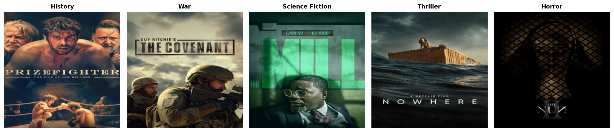

# movie-poster-genre

## Project Overview
This project uses the the movie_posters-100k dataset of movie poster images. Other variables include release year and genre. This project seeks to investigate whether a multiclass model trained on one decade’s posters can accurately predict genres from another decade’s posters.

## Data Overview
The movie_posters-100k dataset is a collection of movie posters spawning across [x] genres. The dataset can be accessed via HuggingFace's `Datasets` library. For the purpose of this project, we have chosen to only use movies released from 1980 onward. The images are 3x224x224 numpy arrays. An example notebook with data loaders is provided in `notebooks/demo.ipynb`.



Link to access the dataset: https://huggingface.co/datasets/skvarre/movie_posters-100k 

## Methods Overview
In progress

## Results
In progress

## Conclusion
In progress

## Setup

1. Clone the repo and install dependencies:
```bash
pip install -e .
```

2. (OPTIONAL) Create a `.env` file in the project root:
```bash
HF_TOKEN=your_token_here
```
The download will still work without a token but may be slower.

Get a free token at [huggingface.co](https://huggingface.co) -> Settings -> Access Tokens.

3. Update `configs/default.yaml` with your own paths:
```yaml
data:
  save_dir: /path/to/images
  metadata_path: /path/to/metadata.csv
```

4. Run the data prep job:
```bash
sbatch scripts/data_prep.sbatch
```
