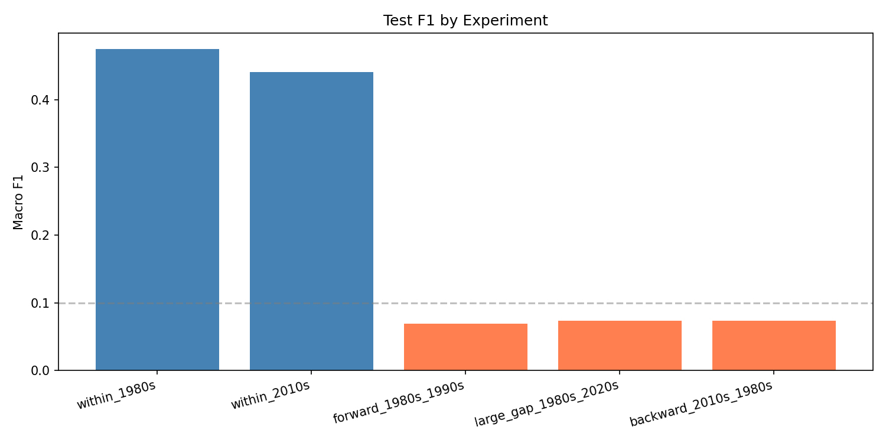
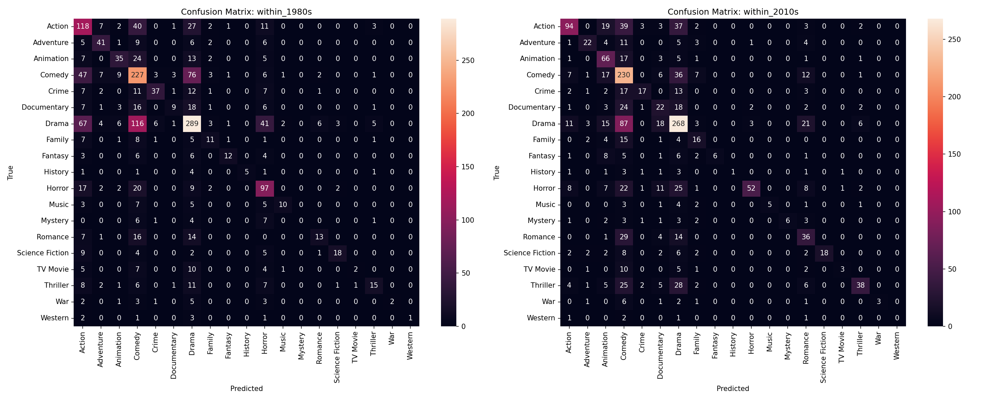
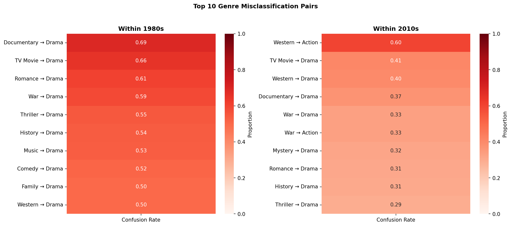

# movie-poster-genre

## Project Purpose

The purpose of this project is to investigate how movie poster design has shifted over time and, more specifically, how this impacts the ability of a CNN to predict genres over time.

This is interesting because movie posters are a very persuasive element of a firm’s advertising efforts. Designs utilize specific design elements, such as coloring, typography, and layout, to portray the film in a static way. These choices usually correspond to genre, but also undergo many shifts throughout time. For example, in the 1980s posters typically took on a minimalist approach, while the 2000s saw the rise of franchise cinema and digital aesthetics. We are curious to see how these shifts have impacted a model’s ability to generalize over time, and which genres have stayed consistent over different eras.

Multiclassification genre prediction for movie posters using CNNs has been done many times before. However, all of the prior work uses random train/validation/test splits that don’t consider the sequential structure of the data. There aren’t any existing studies that test whether a model trained on posters from one decade generalizes to another. The novel aspect seeks to investigate whether a multiclass model trained on one decade’s posters can accurately predict genres from another decade’s posters.

## Data Overview
The movie_posters-100k dataset is a collection of movie posters spawning across 19 genres. The dataset can be accessed via HuggingFace's `Datasets` library. For the purpose of this project, we have chosen to only use movies released from 1980 onward. The images are 3x224x224 numpy arrays. An example notebook with data loaders is provided in `notebooks/demo.ipynb`.


Link to access the dataset: https://huggingface.co/datasets/skvarre/movie_posters-100k 

## Instructions

First, clone the repo and install dependencies:
```bash
pip install -e .
```

### Data Preparation

1. (OPTIONAL) Create a `.env` file in the project root:
```bash
HF_TOKEN=your_token_here
```
The download will still work without a token but may be slower.

Get a free token at [huggingface.co](https://huggingface.co) -> Settings -> Access Tokens.

2. Update the following in `scripts/data_prep.sbatch`:

Set the `cd` path to your project root:
```bash
cd /path/to/movie-poster-genre
```

Update venv name if yours isn't named `venv`:
```bash
source your_venv_name/bin/activate
```

Update `configs/default.yaml` with your data paths:
```yaml
data:
  save_dir: /path/to/images
  metadata_path: /path/to/metadata.csv
  img_size: 224
  quality: 95
```

3. Then submit:
```bash
sbatch scripts/data_prep.sbatch
```

### Training

1. Update `configs/default.yaml` with your paths and experiment settings:
```yaml
data:
  save_dir: /path/to/images
  metadata_path: /path/to/metadata.csv

training:
  batch_size: 64
  lr: 0.0001
  epochs: 20

experiment:
  name: "my_run_v1"
  notes: "brief description of what changed"
```

2. Submit Training Job
```bash
sbatch scripts/train.sbatch
```

3. Monitor Progress
```bash
# check job status
squeue -u <username>

# watch live output
tail -f slurm_logs/train-<jobid>.out

# view TensorBoard
tensorboard --logdir=runs
```

Training results are appended to `all_results.csv` after each run. The best model checkpoint for each experiment is saved to `checkpoints/`.

After training completes, run the evaluation script:
```bash
python evaluate.py --config configs/default.yaml
```

Or open `notebooks/evaluation.ipynb` for interactive evaluation with plots.

## Results

After 6 baseline runs and 1 augmentation run, the best configuration was:
- Learning rate: 0.0001
- Batch size: 64
- Epochs: 20
- Dropout: 0.6
- No augmentation (augmentation hurt within-decade performance without improving transfer)

### Model Performance
| Experiment | Train Decade | Test Decade | Macro F1 |
|------------|-------------|-------------|----------|
| Within-Decade | 1980s | 1980s | 0.481 |
| Within-Decade | 2010s | 2010s | 0.450 |
| Forward Transfer | 1980s | 1990s | 0.081 |
| Large Gap | 1980s | 2020s | 0.056 |
| Backward Transfer | 2010s | 1980s | 0.075 |

Within-decade F1 of ~0.45-0.48 shows that the model is learning meaningful patterns, and is about 9x above the random chance baseline of ~0.05 for a 19-class problem. Transfer F1 of ~0.06-0.08 is nearly random and indicates that the model fails to generalize across decades.

### F1 by Experiment



### Per-Genre F1 Heatmap (Within Decade Experiments)



### Top Confusion Pairs (Within Decade Experiments)



### Findings
The model learns decade-specific visual aesthetics instead of generalizable genre features. F1 score collapses from ~0.45 to ~0.07 across all transfer experiments, regardless of direction or gap size. This indicates that poster design has shifted enough across decades to almost entirely break genre classification.

## Discussion
The model itself is limited by several factors. the first being that building a custom 4-block CNN means that the model has a limited ability to learn universal visual features and relys entirely on patterns in the training decade. Modern architectures such as ResNet may be better suited for this problem. Additionally, movies often span multiple genres (e.g. a romantic comedy) but the model only predicts one, which may introduce noise into both training and evaluation. The model also sees each poster in isolation with no knowledge of when it was made, so it cannot adapt to era-specific visual conventions.

The dataset used is heavily imbalnced, meaning that some genres like Drama and Comedy are heavily represented while others like History and Western are rare, which can skew macro F1. There are also only 4 years of data (2020-2023) makes the 2020s a weaker test set than other decades.

This model is best suited for exploratory analysis of how visual genre conventions have changed over time and as a baseline for future temporal transfer studies using pretrained models.

This model should **not** be used for production genre classification, given that a within-decade F1 of ~0.45 is not reliable enough for real applications, or for cross-era prediction, since a transfer performance of ~0.07 is near-random and practically unusable.
